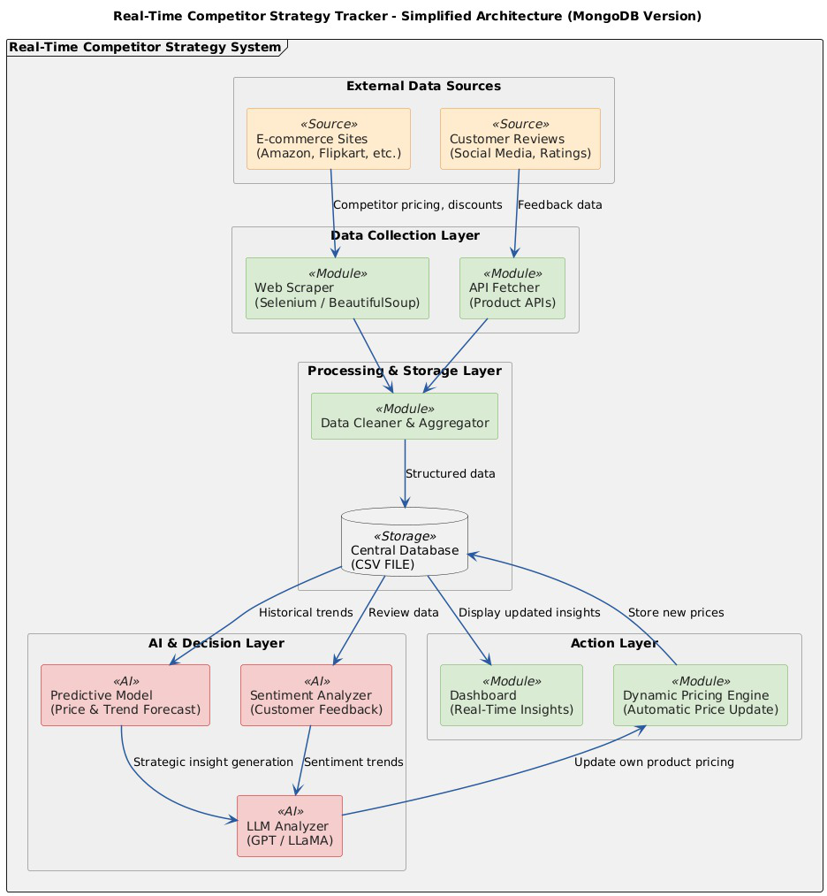

# Real-Time E-Commerce Competitor Strategy Tracker

## Project Overview
An intelligent competitor monitoring system that tracks pricing, discounts, and customer sentiment across e-commerce platforms using LLM-powered analysis.

## Architecture

### System Components

**Data Aggregation Engine**
- Web scraping using BeautifulSoup and Selenium
- CSV-based data storage for scraped competitor information
- Automated scheduling for regular data collection

**Predictive Modeling**
- Price trend analysis and forecasting
- Discount pattern recognition
- Competitive positioning analytics

**Sentiment Analysis**
- Customer review analysis using OpenAI GPT/Meta LLaMA/Grok API
- Real-time sentiment scoring
- Insight generation from customer feedback

**Cross-Platform Integration**
- Slack notification system for real-time alerts
- Dashboard for visualization
- API endpoints for data access

## Tech Stack
- **Scraping**: Python, BeautifulSoup, Selenium
- **Storage**: CSV files
- **Analysis**: OpenAI API, Meta LLaMA, Grok API
- **Notifications**: Slack API
- **Languages**: Python 3.14

## Week 1 Progress
- ✅ Project requirements analysis
- ✅ Architecture design completed
- ✅ GitHub repository setup
- 🔄 Web scraping module - in progress

---
Last Updated: [25-10-2025]
